<div align="center">

# 🎰 Simulation de la Ruine du Casino — Méthode de Monte-Carlo

**Projet de Monte-Carlo et Chaînes de Markov**  
Master Ingénierie Mathématique — Semestre 1

[](https://www.python.org/)
[](https://jupyter.org/)
[](https://numpy.org/)
[](https://matplotlib.org/)

**Auteurs :** AZIZ GBADAMASSI Alain· MERKILED Kemuel · Yu ZIJING 

</div>

---

## 📋 Table des matières

1. [Vue d'ensemble](#vue-densemble)
2. [Structure du dépôt](#structure-du-dépôt)
3. [Modèle mathématique](#modèle-mathématique)
4. [Simulations & Visualisations](#simulations--visualisations)
   - [1. Simulation du processus — Comparaison de lois](#1-simulation-du-processus--comparaison-de-lois)
   - [2. Étude des trois régimes de α](#2-étude-des-trois-régimes-de-α)
   - [3. Test d'adéquation et validation](#3-test-dadéquation-et-validation)
   - [4. Modélisation des rentrées αt](#4-modélisation-des-rentrées-αt)
5. [Dépendances](#dépendances)
6. [Lancer le notebook](#lancer-le-notebook)
7. [Rapport](#rapport)

---

## Vue d'ensemble

Ce projet illustre par la **méthode de Monte-Carlo** les résultats théoriques sur la **probabilité de ruine d'un casino**. Les simulations numériques permettent d'observer empiriquement :

- Les différents **régimes du modèle** selon la valeur du paramètre **α** par rapport à **μ**
- La **robustesse** des résultats face au choix de la loi des gains
- La **validation statistique** du modèle exponentiel via un test d'adéquation (statistique Hn)
- La **convergence** du processus de rentrées vers un modèle linéaire αt

> **Contexte** : Le capital du casino évolue selon un processus de Cramér-Lundberg : gains réguliers (taux α) moins les pertes aux joueurs (somme de variables aléatoires i.i.d. de moyenne μ). La probabilité de ruine `r(y)` est la probabilité que ce capital atteigne 0 avant l'infini.

---

## Structure du dépôt

```
📁 Version finale/
│
├── 📓 Rapport Code CASino AZIZ_MERKILED_ZIJING.ipynb   ← Notebook principal (code + simulations)
│
├── 📄 MERKILED___ZIJING_AZIZ_GBADAMASSI-2.pdf           ← Rapport théorique complet
├── 📄 MERKILED___ZIJING_AZIZ_GBADAMASSI-3.pdf           ← Annexes / rapport complémentaire
│
├── 📁 images/                                            ← Figures extraites du notebook
│   ├── fig_cell2_1.png       ← Simulation processus (3 lois)
│   ├── fig_cell4_2.png       ← TCL cas critique (n=50)
│   ├── fig_cell4_3.png       ← TCL cas critique (n=5000)
│   ├── fig_cell6_0.png       ← Capital Y(t) — cas défavorable
│   ├── fig_cell6_1.png       ← Rapport Y(t)/t — tendance vers α−μ
│   ├── fig_cell6_2.png       ← Probabilité de ruine empirique r(y)
│   ├── fig_cell8_1.png       ← CDF empirique vs exponentielle (Hn)
│   ├── fig_cell8_2.png       ← Distribution de Hn simulé (seuil 95%)
│   ├── fig_cell8_3.png       ← Probabilité de ruine validée
│   ├── fig_cell11_0.png      ← Rentrées A(t) vs αt (petit t)
│   └── fig_cell11_1.png      ← Rentrées A(t) vs αt (grand t)
│
├── .gitignore
└── README.md
```

---

## Modèle mathématique

Le capital du casino au temps `t` est modélisé par :

$$Y(t) = y_0 + \alpha t - \sum_{i=1}^{N(t)} X_i$$

| Symbole | Signification |
|---------|--------------|
| `y₀` | Capital initial du casino |
| `α` | Taux de rentrées (gains du casino par unité de temps) |
| `N(t)` | Processus de Poisson (arrivées des joueurs) |
| `Xᵢ` | Montant gagné par le iᵉ joueur (v.a. i.i.d., moyenne μ) |

**Condition de survie :** α > μ (les rentrées doivent dépasser en moyenne les pertes).

**Probabilité de ruine théorique** (loi exponentielle des gains) :

$$r(y_0) = \frac{\mu}{\alpha} \cdot e^{-\left(\frac{1}{\mu} - \frac{1}{\alpha}\right) y_0}$$

---

## Simulations & Visualisations

### 1. Simulation du processus — Comparaison de lois

**Objectif :** Comparer empiriquement la probabilité de ruine lorsque la loi des gains suit différentes distributions (loi **exponentielle**, loi **uniforme**, loi **gamma**), tout en conservant la même espérance μ.

**Méthode :** Pour chaque loi, on simule 10 000 trajectoires indépendantes jusqu'à un horizon temporel fixé, et on estime la proportion menant à la ruine.

**Paramètres :** `y₀ = 10`, `α = 2`, `μ = 1.9`, `T_max = 50`, `n_sim = 10 000`

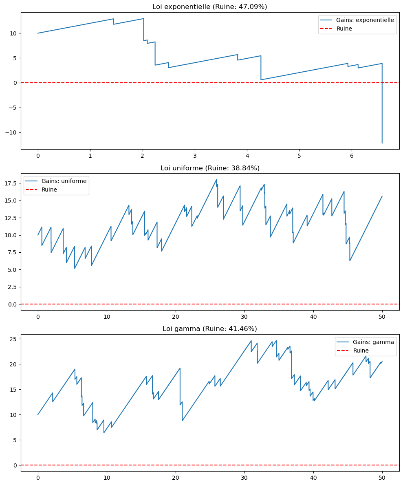

> **Lecture :** Les trois lois (exponentielle, uniforme, gamma) donnent des probabilités de ruine très proches lorsque leur espérance est identique, illustrant la robustesse du modèle par rapport au choix de distribution.

---

### 2. Étude des trois régimes de α

#### 🔵 Cas critique : α = μ

*Lorsque α = μ, l'espérance des incréments est nulle. Le processus se comporte comme une marche aléatoire centrée. Le TCL (Théorème Central Limite) joue un rôle clé.*

**Illustration :** On étudie la convergence en loi de S_n/√n vers une loi normale.

<table>
<tr>
<td align="center"><b>n = 50 simulations</b></td>
<td align="center"><b>n = 5 000 simulations</b></td>
</tr>
<tr>
<td>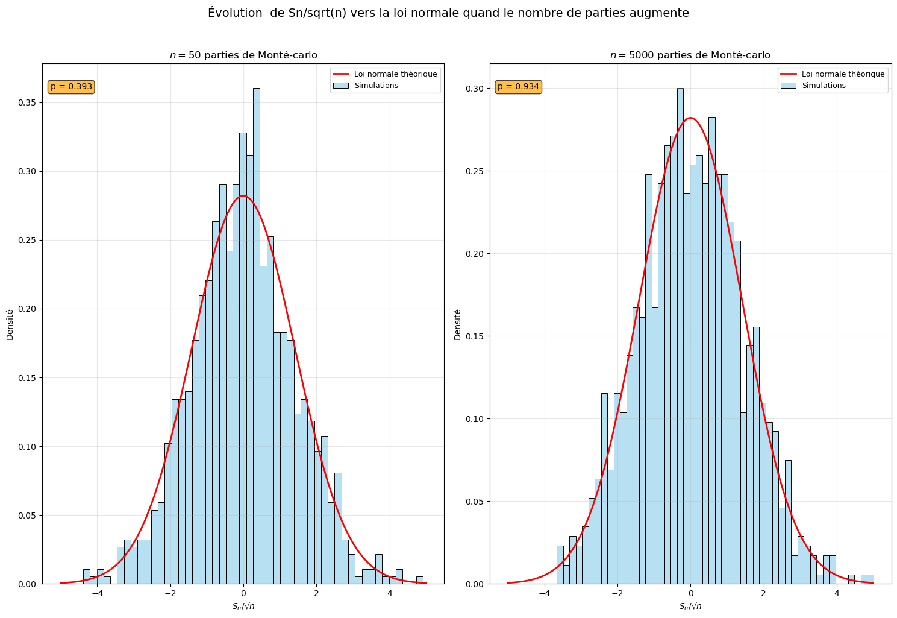</td>
<td>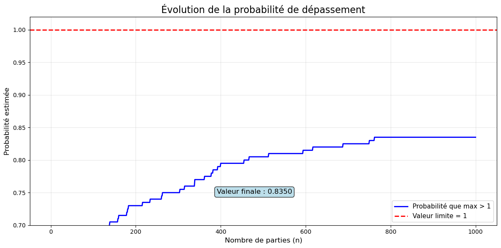</td>
</tr>
</table>

> **Lecture :** Pour n = 50, l'histogramme montre encore de la dispersion. Pour n = 5 000, il se confond presque parfaitement avec la densité normale théorique (en rouge), confirmant la convergence en loi prédite par le TCL.

---

#### 🔴 Cas défavorable : α < μ

*Lorsque α < μ, la dérive moyenne est négative. Le capital décroît en moyenne et la ruine est certaine.*

**Paramètres :** `y₀ = 50`, `α = 2`, `μ = 8`, `n_pas = 1 000`, `n_sim = 200`

**Figure 1 — Évolution du capital Y(t) :**

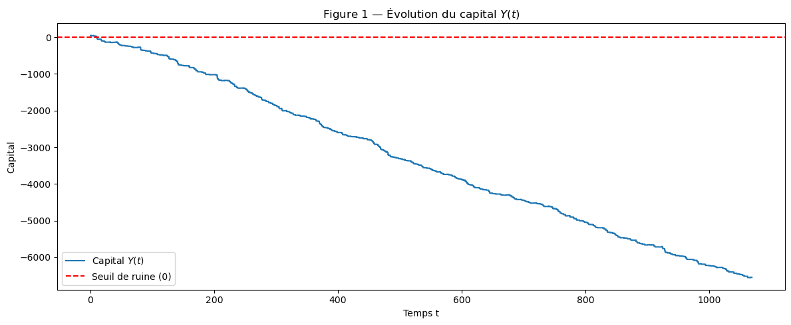

> Le capital chute inexorablement vers 0, la ligne rouge représente le seuil de ruine.

**Figure 2 — Rapport Y(t)/t :**

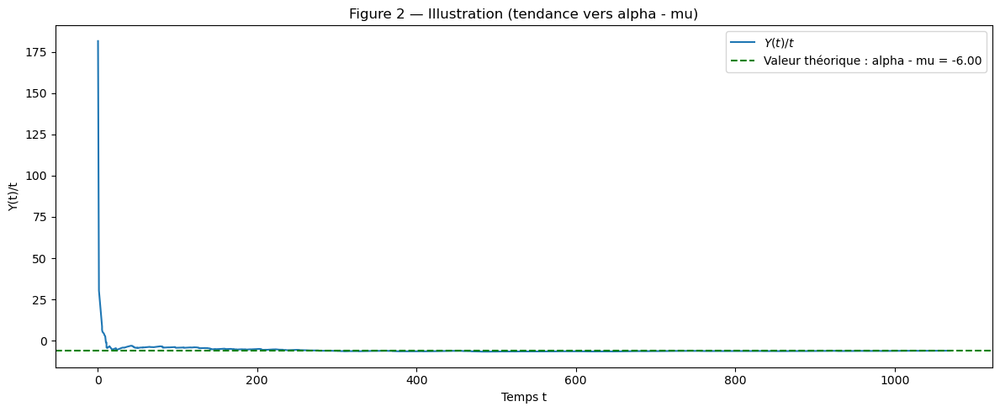

> Par la loi des grands nombres, Y(t)/t converge vers α − μ < 0, confirmant la tendance négative.

**Figure 3 — Probabilité de ruine empirique r(y) :**

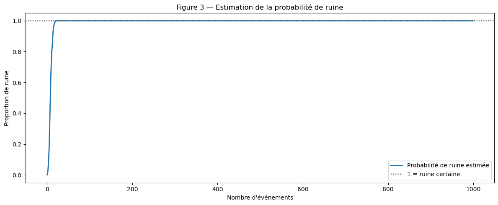

> La probabilité de ruine estimée par Monte-Carlo tend vers 1 pour tout capital initial fini, conformément à la théorie.

---

### 3. Test d'adéquation et validation du modèle exponentiel

**Statistique Hn :** mesure l'écart maximal entre la fonction de répartition empirique Fₙ et la loi exponentielle ajustée F_exp.

$$H_n = \max_{1 \leq i \leq n} |F_n(x_i) - F_{exp}(x_i)|$$

**Paramètres :** `n = 500` gains simulés, `α = 1.2`, `n_sim_test = 1 000`

**Figure 1 — CDF empirique vs CDF exponentielle :**

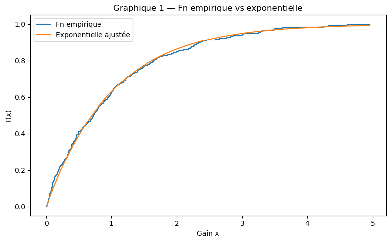

> La courbe empirique (bleue) suit étroitement la CDF exponentielle théorique (rouge), indiquant une bonne adéquation.

**Figure 2 — Distribution de Hn simulée (seuil 95%) :**

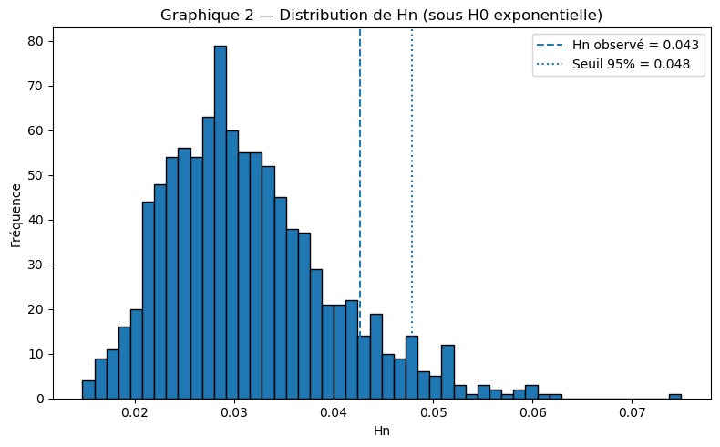

> Le Hn observé (ligne verte) est inférieur au seuil critique à 95% (ligne rouge) → on **ne rejette pas** l'hypothèse exponentielle.

**Figure 3 — Probabilité de ruine après validation :**

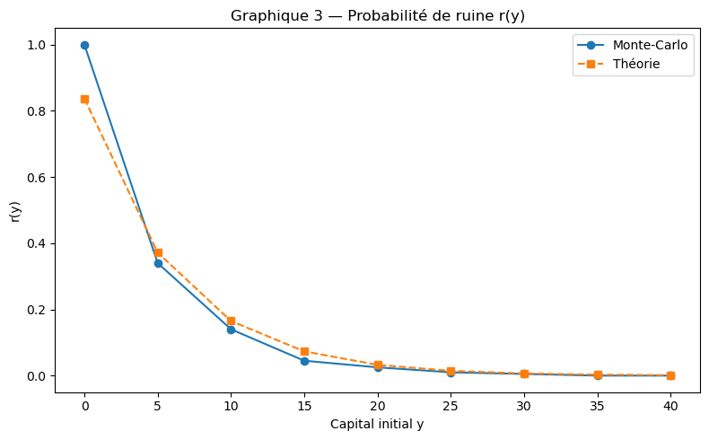

> Après validation du modèle, les résultats de Monte-Carlo concordent étroitement avec la formule théorique de la probabilité de ruine.

---

### 4. Modélisation des rentrées αt

**Objectif :** Montrer que le processus de rentrées aléatoires A(t) (processus de Poisson composé) converge vers le modèle linéaire déterministe αt quand t → ∞.

**Paramètres :** `λ = 5` clients/unité de temps, `dépense_moy = 2`, `α = λ × dépense_moy = 10`

<table>
<tr>
<td align="center"><b>Petit t = 5 (fluctuations fortes)</b></td>
<td align="center"><b>Grand t = 300 (A(t) ≈ αt)</b></td>
</tr>
<tr>
<td>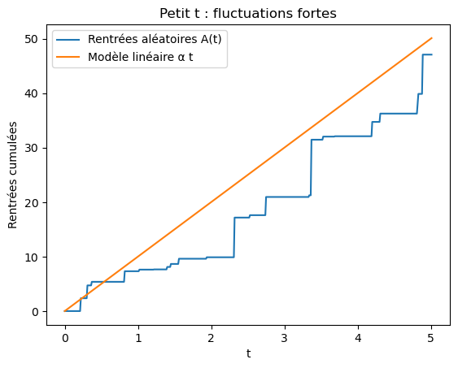</td>
<td>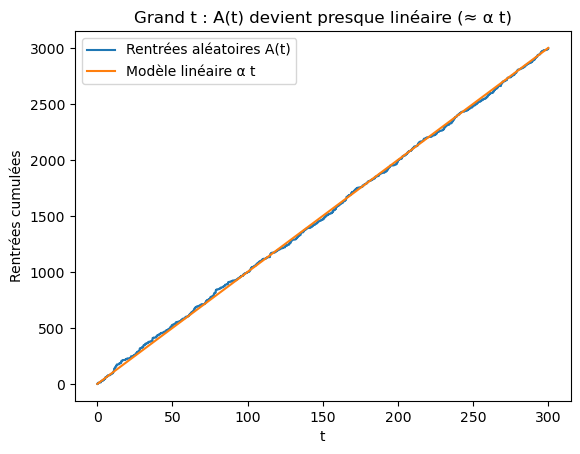</td>
</tr>
</table>

> **Lecture :** Pour petit t, les fluctuations aléatoires sont importantes par rapport à la tendance linéaire. Pour grand t, A(t) devient quasi-linéaire et se confond avec αt, justifiant l'approximation déterministe du modèle.

---

## Dépendances

```bash
pip install numpy matplotlib seaborn scipy
```

| Librairie | Version minimale | Usage |
|-----------|-----------------|-------|
| `numpy` | 1.21+ | Calculs numériques, génération aléatoire |
| `matplotlib` | 3.4+ | Visualisations |
| `seaborn` | 0.11+ | Histogrammes enrichis (cas critique TCL) |
| `scipy` | 1.7+ | Test de Kolmogorov-Smirnov |

---

## Lancer le notebook

```bash
# Cloner le dépôt
git clone https://github.com/<votre-username>/monte-carlo-ruine-casino.git
cd monte-carlo-ruine-casino

# Installer les dépendances
pip install numpy matplotlib seaborn scipy jupyter

# Lancer Jupyter
jupyter notebook "Rapport Code CASino AZIZ_MERKILED_ZIJING.ipynb"
```

---

## Rapport

Le rapport théorique complet est disponible en PDF dans ce dépôt :

- 📄 **[Rapport principal](MERKILED___ZIJING_AZIZ_GBADAMASSI-2.pdf)** — Théorie, démonstrations, résultats
- 📄 **[Rapport complémentaire](MERKILED___ZIJING_AZIZ_GBADAMASSI-3.pdf)** — Annexes et compléments

---

<div align="center">

*Master Ingénierie Mathématique — Monte-Carlo et Chaînes de Markov — Semestre 1*

</div>
